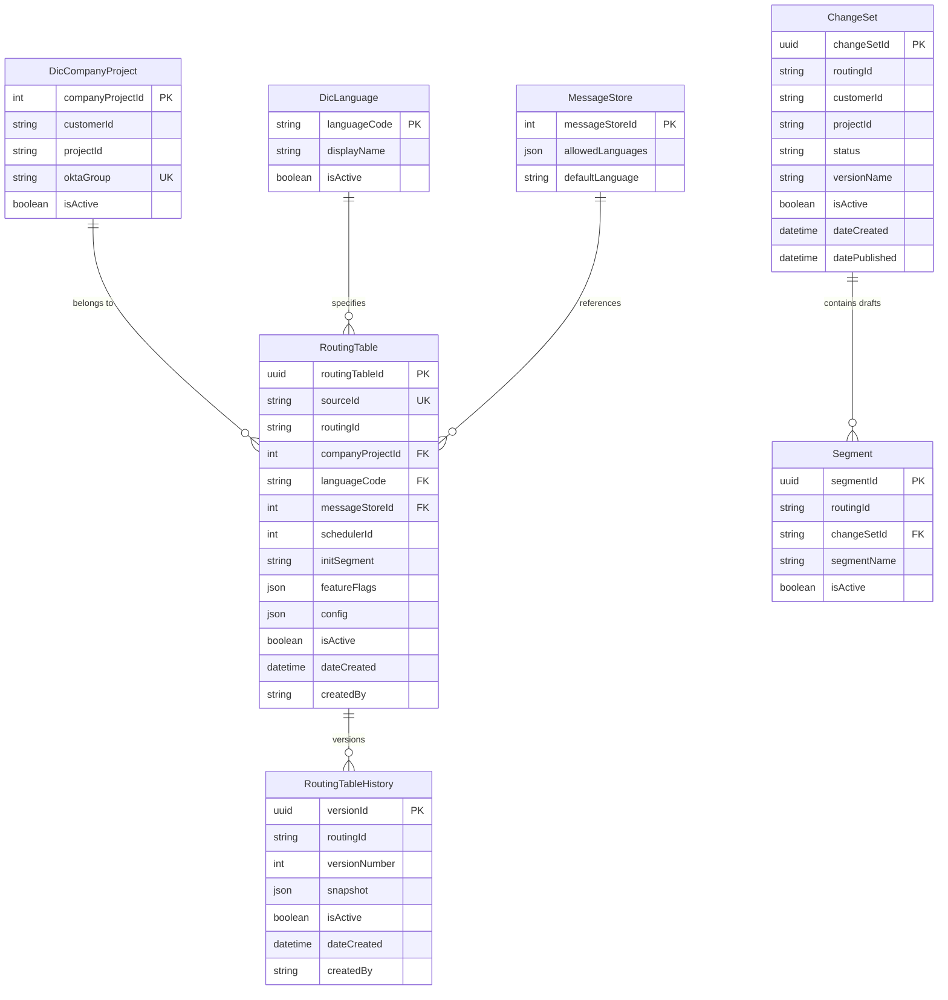

# Routing Table Service

## What is this?

The Routing Table is like a phone book for IVR calls. When someone calls in, we look up their phone number (or an ID) and figure out which call flow to run. Not only external calls, also internal redirects or transfers internally pass by the table to get the relevant data to intialize the call.

Using it, reduces static referenced rouiting logic in each flow, because we use the central table to lookup the needed configuration. Changes to routing, are done in the table, pcked up by all flows, redirects and transfers using it.

Currently this is hardcoded, split of multiple global libraries on Vocalls, making it hard to use flexible routing or building time saving paterns to redirect a call. Doing this by a routing table, you have a customer/project link for each line on the platform. You enforce a uniform naming and standardize logging and reporting. It providfes for simple callflows the needed configuration to intialize the call.


**Simple example:**
- Call comes in from `+3212345678`
- We look it up in the routing table
- Table says: "run flow `EEBL-ENERGYLINE-MAIN` with Dutch language and message store #5"
- IVR starts that flow

That's it. The routing table doesn't execute the flow or play messages - it just tells the system where to route the call.

## Why does it exist?

Before this service, routing logic was scattered across application code. That meant:

- **Hard to change**: Need to redirect calls? Deploy new code and duplciate code across multiple projects.
- **No audit trail**: Who changed the routing? When? No idea.
- **Risky updates**: It's all in code, error prone.
- **Slow rollbacks**: Something breaks? Good luck rolling back.

With the routing table:
- Update a routing entry in the database
- Full version history with snapshots
- Rollback to any previous version in seconds
- Draft/publish workflow to test changes safely

## Quick Start

### Look up a routing

```bash
GET /routing/lookup?sourceId=+3212345678
```

Returns:
```json
{
  "routingId": "EEBL-ENERGYLINE-MAIN",
  "languageCode": "nl-BE",
  "messageStoreId": 5,
  "schedulerId": 12,
  "initSegment": "welcome",
  "featureFlags": { "enableCallRecording": true },
  "config": { "maxRetries": 3 }
}
```

**Performance:** This needs to be fast (under 50ms p95) because it happens on every call.

### Create a routing entry

```bash
POST /routing/entries
{
  "sourceId": "+3212345678",
  "routingId": "EEBL-ENERGYLINE-MAIN",
  "companyProjectId": 10,
  "languageCode": "nl-BE",
  "messageStoreId": 5,
  "schedulerId": 12,
  "initSegment": "welcome",
  "featureFlags": { "enableCallRecording": true },
  "config": { "maxRetries": 3 }
}
```

### Create a version snapshot

Before making risky changes, take a snapshot:

```bash
POST /routing/history
{
  "routingId": "EEBL-ENERGYLINE-MAIN",
  "createdBy": "john.doe@company.com"
}
```

This captures the current state so you can rollback later.

### Rollback to a previous version

```bash
POST /routing/rollback/:versionId
{
  "rolledBackBy": "john.doe@company.com"
}
```

This atomically restores all routing entries from that snapshot.

## How it works

### The data model



### Key concepts

**RoutingEntry**: Maps a `sourceId` to routing configuration
- `sourceId` is unique globally (like "+3212345678" or "MAIN-LINE")
- Points to a `routingId` which groups related entries
- References a message store for prompts
- Can have feature flags and custom config

**RoutingHistory**: Version snapshots for rollback
- One snapshot = all routing entries for a `routingId` at a point in time
- Stored as JSON blob (full snapshot, not just diffs)
- Versions are numbered (1, 2, 3...)

**ChangeSet**: Draft/publish workflow
- Create drafts of routing changes (segments)
- Test them safely
- Publish atomically
- Related segments can be managed together

**Soft deletion**: When you "delete" an entry, we just mark `isActive = false`
- Keeps audit trail intact
- Runtime queries filter to `isActive = true` only

## Common operations

### Runtime lookup (performance critical)

This is the hot path - needs to be under 50ms p95.

**What happens:**
1. Request comes in: `GET /routing/lookup?sourceId=+3212345678`
2. Query database with unique index on `sourceId`
3. Filter for `isActive = true`
4. Return the config

**Why it's fast:**
- Unique index on `sourceId` = O(1) lookup
- No JOINs in the query
- No customer scope filtering (sourceId is globally unique)
- JSON parsing happens in app code, not database

**If not found:** Throws `NotFoundException` - the IVR needs to handle this gracefully.

### Creating a routing entry with validation

**Steps:**
1. Validate `companyProjectId` exists (throws `BadRequestException` if not)
2. Validate `messageStoreId` exists (if provided)
3. Validate `languageCode` is valid BCP47 format (if provided)
4. Check `sourceId` is unique (throws `ConflictException` if duplicate)
5. Create the entry with auto-generated UUID
6. Return the created entry

**Important:** The service validates foreign keys before creating. This prevents orphaned references.

### Creating a version snapshot

**When to use this:** Before making risky changes, take a snapshot.

**Steps:**
1. Find all active entries for the `routingId`
2. If none found, throw `NotFoundException`
3. Serialize everything to JSON (including audit metadata)
4. Get the latest version number and increment it
5. Save to `RoutingTableHistory`

**What gets saved:** The entire routing configuration at this moment - even if the schema changes later, we can still rollback to this exact state.

### Rolling back to a previous version

**This is atomic** - either everything rolls back or nothing does.

**Steps:**
1. Fetch the version snapshot
2. Parse the JSON
3. **Start transaction:**
   - Mark all current active entries as `isActive = false`
   - Create new entries from the snapshot (with new UUIDs)
   - Set `createdBy` to the user doing the rollback
4. **Commit transaction** (or rollback if anything fails)

**Why new UUIDs?** Because we're creating new records, not updating old ones. This keeps the audit trail clean.

### Publishing a ChangeSet

**This is for the draft/publish workflow.** You create a draft ChangeSet, make changes, then publish it atomically.

**Steps:**
1. Validate ChangeSet exists and is in draft/validated state
2. Check state transition is valid
3. **Start transaction:**
   - Archive the old published version
   - Move old segments to archived ChangeSet
   - Create new published segments from drafts (set `changeSetId = NULL`)
   - Copy segment keys and transitions
   - Mark ChangeSet as published
4. **Commit transaction**

**Why `changeSetId = NULL`?** This is how we distinguish published vs draft:
- Published segments have `changeSetId = NULL`
- Draft segments have a specific `changeSetId`

## Module structure

```
routing-table/
├── routing-table.module.ts          # NestJS module
├── routing-table.controller.ts      # REST API endpoints
├── routing-table.service.ts         # Core business logic
├── changeset.controller.ts          # ChangeSet workflow endpoints
├── changeset.service.ts             # Draft/publish logic
├── services/
│   ├── routing-export.service.ts    # Export to JSON
│   ├── routing-import.service.ts    # Import from JSON (with upsert)
│   └── routing-validation.service.ts # Pre-import validation
└── dto/
    ├── create-routing-entry.dto.ts
    ├── update-routing-entry.dto.ts
    ├── routing-entry-response.dto.ts
    ├── version-history.dto.ts
    ├── changeset.dto.ts
    ├── routing-export.dto.ts
    └── routing-import.dto.ts
```

## Database details

**Primary keys:** UUIDs (SQL Server `NEWID()`)

**Soft deletion:** `isActive` boolean flag

**Indexing:**
- Unique index on `sourceId` (for fast lookups)
- Composite index on `routingId + isActive`

**Foreign key behavior:**
- `MessageStore`: `NoAction` (prevents accidental cascade deletes)
- You have to explicitly clean up routing entries before deleting a message store

**JSON storage:**
- `featureFlags` and `config` stored as `NVARCHAR(4000)`
- Parsed in application code

## Things to watch out for

### sourceId must be globally unique

You can't have two active entries with the same `sourceId`. The database enforces this with a unique constraint.

**Common mistake:**
```bash
# First call succeeds
POST /routing/entries { "sourceId": "+3212345678", ... }

# Second call fails with ConflictException
POST /routing/entries { "sourceId": "+3212345678", ... }
```

**Fix:** Use a different `sourceId` or update the existing entry.

### Deleting a MessageStore fails if routing entries reference it

We use `onDelete: NoAction` to prevent accidental data loss.

**What happens:**
```bash
# This will fail if routing entries reference messageStoreId = 5
DELETE /message-stores/5
# Database throws constraint violation
```

**Fix:** Reassign or delete routing entries first.

### Version history grows over time

Every snapshot is a full copy of all routing entries for a `routingId`. This adds up.

**Cleanup:**
```typescript
cleanupOldVersionHistory(routingId, keepVersionCount: 10)
```

This keeps the 10 most recent versions and deletes older ones.

### JSON column size limit

`featureFlags` and `config` are limited to 4000 characters.

**If you hit the limit:** Store large config elsewhere (like a separate config service) and reference it by ID.

### Rollback creates new records

Rollback doesn't restore old UUIDs - it creates new records with the snapshot data. This is intentional (audit trail), but might surprise you if you're tracking by UUID.

## Security

**Authentication:** Azure AD JWT on all endpoints

**Authorization:** Role-based with `@Roles()` decorator
- `RT_VIEWER`: Read-only access
- `RT_EDITOR`: Create/update entries
- `RT_OPS`: Version management, rollback
- `RT_ADMIN`: Full access
- `GLOBAL_ADMIN`: Full access everywhere

**Customer isolation:** `@RequireCustomerScope()` decorator
- Filters data by user's Okta groups
- Example: `okta-digipolis-flow` can only access Digipolis data

**Input validation:** DTOs with `class-validator` decorators

**SQL injection protection:** Prisma uses parameterized queries

## Why we built it this way

### Why UUIDs instead of integers?

UUIDs allow distributed ID generation without coordination. If we need to shard the database later, we don't have to worry about ID collisions.

**Trade-off:** Slightly more storage, but way more flexibility.

### Why soft deletion (`isActive`) instead of hard delete?

- Preserves audit trail for compliance
- Enables "undelete" if needed
- Maintains referential integrity for historical snapshots
- Runtime queries just filter to `isActive = true` (no performance hit)

**Trade-off:** Database grows over time, but we can clean up old entries with retention policies.

### Why JSON snapshots instead of normalized references?

When you rollback, you want the **exact** state from that moment - even if the schema changed since then.

If we stored normalized references, we'd have to reconstruct the state with JOINs, and schema changes would break rollback.

**Trade-off:** More storage and JSON parsing cost, but guaranteed accurate rollback.

### Why `changeSetId = NULL` for published?

Makes querying simple:
- Published: `WHERE changeSetId IS NULL`
- Draft: `WHERE changeSetId = ?`
- Both: `WHERE changeSetId = ? OR changeSetId IS NULL`

**Trade-off:** NULL semantics require careful handling, but the mental model is clear.

### Why NoAction for MessageStore foreign key?

Prevents accidental data loss. If you delete a message store that routing entries reference, the database blocks the delete.

Forces you to explicitly clean up:
1. Reassign routing entries to a different message store, OR
2. Delete routing entries first

**Trade-off:** Multi-step deletion process, but way safer.

### Why <50ms p95 for runtime lookup?

IVR calls need near-instant routing. If lookup takes too long, callers hear dead air.

**How we achieve it:**
- Unique index on `sourceId`
- No JOINs in hot path
- No customer scope filtering
- Minimal validation


---

**File location:** [services/backend/src/modules/routing-table/](../services/backend/src/modules/routing-table/)

**Last updated:** 2026-01-20
