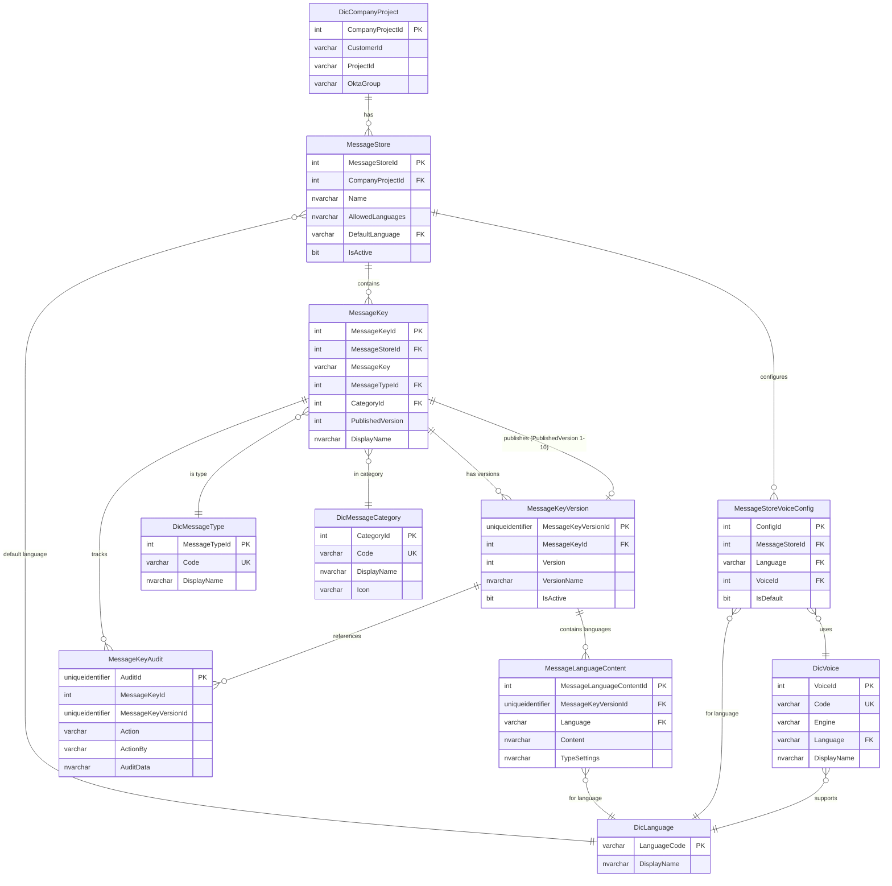

# Message Store - Design Doc

**Version**: 5.0.0
**Last Updated**: 2026-01-20
**Stack**: NestJS + Prisma + SQL Server

---

## What This Is

The Message Store is a centralized content management system for all IVR messages. Instead of embedding "Welcome to our service" directly in flow configurations, flows reference messages by key (e.g., `WELCOME_PROMPT`). The actual content—text, audio URLs, or AI prompts—lives in the Message Store and can be updated independently of flow deployments.

**Key Capabilities:**
- Centralized content library organized by customer/project
- Atomic versioning: all languages move together per version (no drift)
- Reference by key: flows use `messageKey: "WELCOME_PROMPT"` instead of embedded content
- Version history: up to 10 versions per message with full rollback
- Draft/publish workflow: edit safely in draft, publish when ready
- Fast runtime: fetches messages in under 30ms during live calls
- API integration: schedulers and external systems can manage messages programmatically
- Type flexibility: supports TTS, audio, LLM prompts, and custom message types with configurable schemas

---

## Current Situation

### Content Management Problems

**Hardcoded and Duplicated Content:**
- Messages are embedded directly in flow configurations or hardcoded in application code
- Same message exists in multiple flows—updating requires finding and changing each instance
- Each prompt requires a separate node in the graphical flow designer with individual configuration

**Language Synchronization Issues:**
- Languages are updated independently, causing version drift (e.g., Dutch v3 with French v1)
- Switching languages in the Vocalls interface can corrupt or mix prompts
- No visibility into which languages are missing or out of sync
- Translators must update each language separately without seeing the full picture

**Operational Limitations:**
- Only developers can update messages, creating a bottleneck for content changes
- Updating messages requires code changes, configuration updates, and production deployments
- No version history—previous message content is lost once changed
- No way to quickly fix confusing prompts during incidents
- Difficult to schedule ad-hoc messages (holiday greetings, announcements)

**Technical Debt:**
- Flow configurations are cluttered with embedded content instead of clean message key references
- Hard to track which flows use which messages
- Messages scattered across codebase—easy to miss or duplicate
- Limited export options (only TTS messages exportable from graphical interface)
- **MyScheduler** lacks a unified message management solution

---

## How The Solution Addresses These Problems

### Content Management

**Centralized Storage:**
- Single source of truth for all messages, organized by customer/project
- Messages referenced by key from flows—update once, changes propagate everywhere
- Complete inventory of all messages and content used across flows

**Self-Service Operations:**
- Operations teams and customers can update messages without developer involvement
- No code deployments required for content changes
- Quick fixes during incidents without waiting for development cycles

### Language Management

**Atomic Versioning:**
- All languages move together in each version—no more version drift
- Translators see all languages side-by-side when updating
- Validation ensures all required languages are present before publishing
- Preview capability before publishing changes

### Developer Experience

**Cleaner Flow Configurations:**
- Flows contain message keys instead of embedded content (reduces configuration from ~10 lines to 1 line)
- Easier to track message usage across flows
- Less error-prone—no more missing or misplaced prompts

**Reduced Maintenance:**
- Eliminates need for custom code to manage prompts dynamically
- Removes complexity of managing prompt-related nodes and logic in flows
- Type system allows custom message types with configurable properties

### Advanced Use Cases

**LLM Prompt Management:**
- Iterate on LLM prompts while maintaining version history
- Dynamically provide prompts or LLM messages to flow segments
- Track which prompt versions perform best

**External System Integration:**
- Schedulers and MyCallflow can retrieve messages programmatically via API
- Messages available in any version and language for ad-hoc usage
- Resolves scheduler prompt management issues

**Audit and Compliance:**
- Complete version history for audit trails
- Track all changes with timestamps and user attribution
- Export capabilities for backups and migrations

---

## How It Works

### Architecture Overview

The Message Store operates as a content library with the following structure:

```
MessageStore (per customer/project)
  └── MessageKey (e.g., "WELCOME_PROMPT")
      └── MessageKeyVersion (version 1, 2, 3...)
          └── MessageLanguageContent (nl-BE, fr-BE, en-US...)
```

**Key Concepts:**
- **Message Store**: Container for messages, scoped to a customer/project
- **Message Key**: Unique identifier for a message (e.g., `WELCOME_PROMPT`)
- **Version**: Atomic snapshot containing all languages—when you create version 2, all languages move together
- **Published Version**: The active version used by the runtime (1-indexed)
- **Message Type**: Defines the schema for message content (TTS, audio, LLM, custom)

### Before/After Example

**Before (embedded content):**
```json
// Content copy-pasted in graphical design node
// Each language requires separate configuration
// Changes require switching languages, risking corruption
// Must repeat for every prompt in every flow
```

**After (message key reference):**
```json
{
  "segmentType": "play_message",
  "config": {
    "messageKey": "WELCOME_PROMPT"
  }
}
```

The flow configuration is now a single line. All language content is managed in the Message Store.

---

## What It's Responsible For

### Content Management
- CRUD operations on messages identified by unique keys
- Storing content in type-specific formats (text, audio URLs, AI prompts, custom schemas)
- Organizing messages by type (TTS, audio, LLM) and category (welcome, menu, error, etc.)
- Maintaining up to 10 versions per message with full rollback capability

### Version Control
- Tracking which version is published (active in production)
- Ensuring all languages are included in each version (atomic versioning)
- Enabling rollback to any previous version
- Maintaining complete version history for audit purposes

### Multi-Language Support
- Storing content for multiple languages within each version
- Validating language codes against allowed languages for the message store
- Ensuring language synchronization across versions

### Runtime Delivery
- Fast message retrieval (< 30ms) for IVR runtime during live calls
- Graceful handling of missing messages
- API endpoints for schedulers and external systems

### Integration & Export
- Programmatic API for message management
- Export/import capabilities for migrations and backups
- Audit logging for compliance and change tracking

### What Goes Out

| What | To Where | Why |
|------|----------|-----|
| Message content | IVR runtime | Play to callers (< 30ms) |
| Version history | Management UI | Audit trail, compliance |
| Export files | Backup systems | Migrations, version control |
| Audit records | Compliance systems | Track changes |

### What It Depends On

- **DicCompanyProject** - Customer/project organization (multi-tenant)
- **DicLanguage** - Valid language codes (nl-BE, fr-BE, en-US)
- **DicMessageType** - Message types (tts, audio_url, llm stuff)
- **DicMessageCategory** - Categories (welcome, menu, error, etc.)
- **DicVoice** - TTS voice options per language

### Who Uses It

**Segment Store:**
- References messages by key in segment configs
- Multiple segments can use the same message
- Runtime resolves key → content during calls

**Routing Table:**
- Links to message stores (each routing entry picks a message store)
- Multiple routings can share one message store

**IVR Runtime:**
- Fetches messages during live calls (< 30ms requirement)
- Falls back to default language if requested one doesn't exist

**MyCallflow UI:**
- External editing interface for business users
- Manages messages via REST API

**Schedulers:**
- Update messages programmatically based on business rules
- Time-based changes (holiday greetings, business hours)


---

## Where It Fits

The Message Store is the source of truth for all message content in the IVR platform.

```
Management UI
     ↓
Message Store (you are here)
     ↓
     ├→ Segment Store (references message keys)
     ├→ Routing Table (links to stores)
     └→ IVR Runtime (fetches during calls)
```

**How it fits:**
- **Source of truth** - This is where message content lives
- **Independent** - Not controlled by other modules
- **Content provider** - Consumed by flows, doesn't execute them
- **Support service** - Enables other modules but doesn't drive the main call workflow

**Design choices:**
- **Environment** - Isolated by environment
- **Independent from ChangeSet** - Messages have their own draft/publish workflow, separate from flow versioning
- **Read-optimized** - Published messages are cached/indexed for fast runtime fetches
- **Protected** - Can't delete a message store if routing tables still reference it
- **Audit** - Each manipulation is logged in audit table
---

## Message Reusability and Languages

### Why Reusability Rocks

Instead of copying the same message text across 10 different flows, you reference it once by key. Update it in one place, all flows get the update.

**Example: `WELCOME_PROMPT` used everywhere**

```
MessageStore: "ENGIE Customer Care"
  └── WELCOME_PROMPT (Version 3 - Published)
      ├── nl-BE: "Welkom bij ENGIE. Hoe kunnen wij u helpen?"
      ├── fr-BE: "Bienvenue chez ENGIE. Comment pouvons-nous vous aider?"
      └── en-US: "Welcome to ENGIE. How can we help you?"

      Used in:
      ├── Main Menu flow (init segment)
      ├── Callback flow (greeting segment)
      ├── Emergency Line (intro segment)
      └── After Hours scheduler
```

**What happens when you publish version 4:**
- Update message once in the UI
- Hit publish
- All 4 places now use version 4 immediately
- No touching flow configs
- Rollback? All 4 revert together

**Why this is better:**

| Thing | Old Way (Copy-Paste) | New Way (Message Store) |
|-------|---------------------|------------------------|
| Updates | Change text in 10 places | Change once, done |
| Consistency | Easy to miss one, now they're different | Always consistent |
| Translation | Translate 10 times | Translate once |
| History | No clue what it said before | Full version history |
| Testing | Test all 10 flows | Just test the message |
| Who does it | Devs | Content team (self-service) |

### How Atomic Versioning Works (No More Language Drift!)

In v5.0.0, all languages move together in a version. No more Dutch on v3 while French is stuck on v1.

**Example: Updating a 3-language message**

```
Version 1 (Published):
   nl-BE: "Welkom. Druk 1 voor service."
   fr-BE: "Bienvenue. Appuyez sur 1 pour le service."
   en-US: "Welcome. Press 1 for service."

Someone wants to change Dutch "Druk" to "Kies":

Create Version 2 (Draft):
   nl-BE: "Welkom. Kies 1 voor service." ← UPDATED
   fr-BE: "Bienvenue. Appuyez sur 1 pour le service." ← copied from v1
   en-US: "Welcome. Press 1 for service." ← copied from v1

French translator sees the update, makes their change too:
   nl-BE: "Welkom. Kies 1 voor service."
   fr-BE: "Bienvenue. Choisissez 1 pour le service." ← NOW UPDATED
   en-US: "Welcome. Press 1 for service."

Hit Publish on Version 2:
   → All 3 languages go live together
   → No chance of mixed versions
```

**What translators get:**
- See all languages side-by-side when editing
- Can't publish if a language is missing
- Preview all languages in draft before going live
- Rollback affects all languages (no partial rollbacks)

### Scheduler and External Systems

Schedulers and other systems (like MyCallflow) can manage messages via the API.

**Example: Auto-switching holiday greeting**

```typescript
// Dec 1st: Switch to holiday greeting
async function updateHolidayGreeting() {
  // Create new version with holiday content
  const newVersion = await messageStoreAPI.createVersion({
    messageStoreId: 42,
    messageKey: "WELCOME_PROMPT",
    languages: [
      {
        language: "nl-BE",
        content: "Prettige feestdagen! Welkom bij ENGIE.",
        typeSettings: { voice: "nl-BE-Wavenet-A", speed: 0.95 }
      },
      {
        language: "fr-BE",
        content: "Joyeuses fêtes! Bienvenue chez ENGIE.",
        typeSettings: { voice: "fr-BE-Wavenet-A", speed: 0.95 }
      }
    ],
    versionName: "Holiday 2025",
    createdBy: "scheduler@system.com"
  });

  // Publish it
  await messageStoreAPI.publishVersion({
    messageStoreId: 42,
    messageKey: "WELCOME_PROMPT",
    version: newVersion.version,
    actionBy: "scheduler@system.com",
    actionReason: "Holiday greeting activated"
  });
}

// Jan 7th: Switch back to normal
async function revertToStandardGreeting() {
  await messageStoreAPI.rollbackVersion({
    messageStoreId: 42,
    messageKey: "WELCOME_PROMPT",
    targetVersion: 2, // Normal greeting
    actionBy: "scheduler@system.com",
    actionReason: "End of holidays"
  });
}
```

**Common use cases:**

| System | What For | What It Does |
|--------|----------|--------------|
| Scheduler | Seasonal messages | Create/publish/rollback on schedule |
| MyCallflow UI | Content editing | Full CRUD, version management, preview |
| Emergency alerts | Urgent updates | Bulk update + immediate publish |
| Translation service | Auto-translate | Batch create versions |
| CMS | Import/export | Backup and migrations |
| Compliance | Auditing | Query audit history |

### How Message Store Simplifies Flows

**Flow Configuration Comparison**

**Traditional Approach (Embedded Content):**
```json
{
  "routingId": "EEBL-ENERGYLINE-MAIN",
  "segments": [
    {
      "segmentName": "welcome",
      "segmentType": "play_message",
      "config": {
        "messages": {
          "nl-BE": {
            "text": "Welkom bij ENGIE. Voor Nederlands, druk 1. Voor Frans, druk 2.",
            "voice": "nl-BE-Wavenet-A",
            "speed": 1.0
          },
          "fr-BE": {
            "text": "Bienvenue chez ENGIE. Pour le néerlandais, appuyez sur 1. Pour le français, appuyez sur 2.",
            "voice": "fr-BE-Wavenet-A",
            "speed": 1.0
          },
          "en-US": {
            "text": "Welcome to ENGIE. For Dutch, press 1. For French, press 2.",
            "voice": "en-US-Wavenet-D",
            "speed": 1.0
          }
        }
      }
    },
    {
      "segmentName": "menu",
      "segmentType": "menu",
      "config": {
        "prompts": {
          "nl-BE": {
            "text": "Druk 1 voor facturatie, 2 voor technische ondersteuning, 3 voor nieuwe aansluitingen.",
            "voice": "nl-BE-Wavenet-A"
          },
          "fr-BE": {
            "text": "Appuyez sur 1 pour la facturation, 2 pour l'assistance technique, 3 pour les nouveaux raccordements.",
            "voice": "fr-BE-Wavenet-A"
          },
          "en-US": {
            "text": "Press 1 for billing, 2 for technical support, 3 for new connections.",
            "voice": "en-US-Wavenet-D"
          }
        },
        "options": {...}
      }
    }
  ]
}
```

**Message Store Approach (v5.0.0):**
```json
{
  "routingId": "EEBL-ENERGYLINE-MAIN",
  "segments": [
    {
      "segmentName": "welcome",
      "segmentType": "play_message",
      "config": {
        "messageKey": "LANGUAGE_SELECTION_PROMPT"
      }
    },
    {
      "segmentName": "menu",
      "segmentType": "menu",
      "config": {
        "messageKey": "MAIN_MENU_PROMPT",
        "options": {...}
      }
    }
  ]
}
```

**Simplification Impact:**

- **80% less configuration size**: ~50 lines → ~10 lines
- **Zero embedded translations**: All content in Message Store
- **Flow becomes logic-only**: Only structure and transitions, no content
- **Content updates don't touch flows**: Change message via UI, no deployment needed
- **Easier to understand**: Developers see flow logic without content noise
- **Version control friendly**: Flow configs don't change for content updates

---

## 6. Domain Model (Conceptual)

### Main Tables

**MessageStore**
Container for a customer/project's messages. Sets which languages are allowed and default voice settings.

**MessageKey**
The message identifier (like `WELCOME_PROMPT`). Tracks which version is published and metadata like display name and category.

**MessageKeyVersion**
A version snapshot with content for ALL languages. You can have up to 10 versions numbered 1-10.

**MessageLanguageContent**
The actual message text/URL for one language in one version. Each version has one of these per language.

**MessageStoreVoiceConfig**
Voice preferences per language (like "use Belgian Dutch female voice for nl-BE").

**MessageKeyAudit**
Unchangeable log of every action on a message (created, edited, published, rolled back, deleted).

### Reference Data

**DicMessageType**
Message types: `tts`, `audio_url`, `llm_message`, `llm_prompt`, `llm_dialog`

**DicMessageCategory**
Message categories: `welcome`, `menu`, `identification`, `queue`, `transfer`, `error`, `llm_system`, `general`

**DicVoice**
Available TTS voices from Google, Azure, Amazon, ElevenLabs (with language, gender, style)

### How They Connect

- MessageStore → belongs to one CompanyProject
- MessageStore → has many MessageKeys
- MessageKey → has up to 10 MessageKeyVersions
- MessageKey → publishes ONE version (integer pointer 1-10)
- MessageKeyVersion → has many MessageLanguageContents (one per language)
- MessageStore → has voice configs (one per language)

---

## 7. Logical Data Model



**Key Constraints:**

- **Unique message keys**: `(MessageStoreId, MessageKey)` must be unique
- **Unique versions**: `(MessageKeyId, Version)` must be unique
- **Version range**: `Version` must be between 1 and 10
- **Unique language content**: `(MessageKeyVersionId, Language)` must be unique
- **Audit retention**: `MessageKeyAudit` has no foreign keys to allow retention after deletion

---

## Common Workflows

### Creating a New Message

1. User fills out form:
   - Message key (like `WELCOME_PROMPT`)
   - Type (`tts`, `audio_url`, etc.)
   - Category (`welcome`, `menu`, etc.)
   - Content for all required languages
   - Settings (voice, speed, etc.)

2. System checks:
   - Message store exists and you have access
   - Message key doesn't already exist
   - Language codes are valid
   - Type and category are valid

3. System creates in one transaction:
   - MessageKey record
   - MessageKeyVersion record (version 1)
   - MessageLanguageContent for each language
   - Audit log entry

4. Result: Message exists as version 1 in draft (PublishedVersion = NULL). Not visible to runtime yet.

---

### Updating a Message (Creating New Version)

1. User submits update:
   - Store ID + message key
   - New content for one or more languages
   - Optional: version name

2. System checks:
   - Message exists
   - You have edit permission
   - Haven't hit the 10 version limit

3. System calculates next version number (max + 1)

4. System creates in one transaction:
   - New MessageKeyVersion (v2, v3, etc.)
   - New MessageLanguageContent for ALL languages:
     - New content where you changed it
     - Copied content for unchanged languages
   - Audit log entry

5. PublishedVersion stays the same (still pointing to old version)

6. Result: New draft version exists. Published version unchanged.

---

### Publishing a Version

1. User hits publish:
   - Store ID + message key
   - Version number (1-10)
   - Optional: reason

2. System checks:
   - Message exists
   - Version exists
   - You have publish permission

3. System updates:
   - Sets MessageKey.PublishedVersion = version number
   - Logs it

4. Result: Version goes live immediately. Runtime fetches get the new content.

---

### Rolling Back

User realizes current version is broken:

1. User submits rollback request with:
   - Message store ID and message key
   - Target version number (must be < current published version)
   - Reason for rollback

2. System validates:
   - Message key exists and has a published version
   - Target version exists and is active
   - User has rollback permissions

3. System updates **atomically**:
   - Sets `MessageKey.PublishedVersion` = target version number
   - Creates `MessageKeyAudit` record for rollback event

4. System returns:
   - Updated message key with rolled-back version pointer

**Outcome**: Previous version becomes live again. No data is created or destroyed, only the pointer changes.

---

### Workflow 5: Runtime Message Fetch

**Actor**: IVR Call Flow Engine
**Trigger**: Call flow needs to play a message during active phone call

1. IVR engine sends runtime fetch request with:
   - Message key (e.g., `WELCOME_PROMPT`)
   - Language code (e.g., `nl-BE`)
   - Message store ID

2. System queries:
   ```sql
   -- Step 1: Get message key and published version pointer
   SELECT MessageKeyId, PublishedVersion
   FROM MessageKey
   WHERE MessageStoreId = ? AND MessageKey = ?

   -- Step 2: Get version details
   SELECT MessageKeyVersionId
   FROM MessageKeyVersion
   WHERE MessageKeyId = ? AND Version = ?

   -- Step 3: Get language content
   SELECT Content, TypeSettings
   FROM MessageLanguageContent
   WHERE MessageKeyVersionId = ? AND Language = ?
   ```

3. System validates:
   - Message key exists
   - Published version is not NULL
   - Language content exists

4. System returns (within 30ms target):
   - Content text/URL
   - Type settings (voice, speed, etc.)

5. If not found:
   - Returns 404 with clear error message

**Outcome**: IVR engine receives message content to play to caller, or fails fast if message not available.

---

### Workflow 6: Import Messages

**Actor**: System Administrator
**Trigger**: Bulk migration from another system or restore from backup

1. User uploads import file (JSON format) with:
   - Message metadata (keys, types, categories)
   - Content for all languages per message
   - Optional: version names and settings

2. System validates:
   - Import file format is correct
   - All referenced languages are valid
   - No duplicate message keys in import
   - Message types and categories exist

3. System performs **preview** (dry run):
   - Identifies which messages are new vs. existing
   - Reports conflicts and warnings
   - Returns import plan to user

4. User confirms import

5. System processes **atomically per message**:
   - For new messages: Create MessageKey + Version 1 + Languages
   - For existing messages: Create new version with imported content
   - Skip messages that conflict (report in summary)
   - Create audit records for all imports

6. System returns:
   - Import summary (created, updated, skipped counts)
   - Detailed log of actions taken

**Outcome**: Bulk messages loaded into system with full audit trail.

---

### Workflow 7: Export Messages

**Actor**: System Administrator
**Trigger**: Backup, migration, or sharing message catalog

1. User requests export with filters:
   - Optional: specific message keys
   - Optional: message types (e.g., only `tts`)
   - Optional: languages (e.g., only `nl-BE` and `fr-BE`)
   - Optional: include full content or just manifest

2. System queries messages matching filters

3. System generates export file (JSON) with:
   - **Manifest**: Metadata for all matching messages (keys, types, languages, version counts)
   - **Messages** (if requested): Full content and settings for published versions

4. System returns:
   - JSON export file
   - Summary statistics (message count, languages, types)

**Outcome**: Portable export file suitable for backup, version control, or migration to another environment.

---

## 9. Technical Architecture

### Runtime Model

**Framework**: NestJS (Node.js 20 LTS)
**ORM**: Prisma (code-first schema with SQL Server)
**Database**: SQL Server (Azure SQL or on-premises)
**Schema**: `ivr` (all message tables use `ivr` schema with `msg_` prefix)

**Module Structure**:

```
services/backend/src/modules/message-store/
├── message-store.module.ts           # NestJS module definition
├── message-store.controller.ts       # Store-level endpoints
├── message-key.controller.ts         # Message CRUD endpoints
├── message-key-runtime.controller.ts # Runtime fetch endpoints
├── message-store.service.ts          # Store management logic
└── services/
    ├── message-key.service.ts            # Message CRUD operations
    ├── message-key-runtime.service.ts    # Optimized runtime fetch
    ├── message-key-audit.service.ts      # Audit trail queries
    ├── message-export.service.ts         # Export logic
    ├── message-import.service.ts         # Import logic with validation
    └── message-validation.service.ts     # Shared validation rules
```

### Persistence Approach

**Primary Key Strategy**:
- `MessageStore.MessageStoreId`: INT IDENTITY (database-generated)
- `MessageKey.MessageKeyId`: INT IDENTITY (database-generated)
- `MessageKeyVersion.MessageKeyVersionId`: UUID (NEWID() in database)
- `MessageLanguageContent.MessageLanguageContentId`: INT IDENTITY

**Atomic Versioning Pattern**:

All languages are versioned together to prevent language drift:

```typescript
// Create new version (all languages together)
await prisma.$transaction(async (tx) => {
  // 1. Create version container
  const version = await tx.messageKeyVersion.create({
    data: {
      messageKeyId: messageKey.messageKeyId,
      version: nextVersionNumber,
      versionName: dto.versionName,
      createdBy: user.email,
    },
  });

  // 2. Create language content for ALL languages
  for (const lang of allLanguages) {
    await tx.messageLanguageContent.create({
      data: {
        messageKeyVersionId: version.messageKeyVersionId,
        language: lang.code,
        content: lang.content,
        typeSettings: JSON.stringify(lang.settings),
        createdBy: user.email,
      },
    });
  }

  // 3. Audit the version creation
  await tx.messageKeyAudit.create({
    data: {
      messageKeyId: messageKey.messageKeyId,
      messageKeyVersionId: version.messageKeyVersionId,
      action: 'edited',
      actionBy: user.email,
      auditData: JSON.stringify({ version: nextVersionNumber }),
    },
  });
});
```

**Published Version Pointer**:

Uses integer pointer (1-10) instead of UUID for simpler queries:

```typescript
// Publish version
await prisma.messageKey.update({
  where: { messageKeyId },
  data: {
    publishedVersion: versionNumber, // Simple integer 1-10
    updatedBy: user.email
  },
});
```

### Integration Patterns

**REST API**:
- Base path: `/api/v1/messages/`
- Authentication: JWT bearer tokens (Okta OIDC)
- Authorization: Role-based (MSG_VIEWER, MSG_EDITOR, MSG_PUBLISHER, MSG_ADMIN)
- Tenant isolation: Customer scope decorator enforces data boundaries

**API Groups**:

1. **Store Management** (`/stores`)
   - List, create, update message stores
   - Configure voice settings per language

2. **Message Key Management** (`/stores/{storeId}/message-keys`)
   - CRUD operations on message keys
   - List messages with filtering

3. **Version Management** (`/stores/{storeId}/message-keys/{key}/versions`)
   - List all versions for a message
   - Get specific version details
   - Create new version (update content)

4. **Lifecycle Operations** (`/stores/{storeId}/message-keys/{key}/publish`)
   - Publish version
   - Rollback to previous version

5. **Audit Trail** (`/stores/{storeId}/message-keys/{key}/audit`)
   - View change history

6. **Runtime Fetch** (`/runtime/fetch?messageKey={key}&lang={lang}&storeId={id}`)
   - High-performance read-only endpoint
   - Used by IVR engine during calls
   - Optimized with indexes

7. **Import/Export** (`/stores/{storeId}/export`, `/stores/{storeId}/import`)
   - Bulk operations for migrations and backups

**Error Handling**:
- 400 Bad Request: Validation errors, version limit exceeded
- 404 Not Found: Message key or version doesn't exist
- 403 Forbidden: Insufficient permissions
- 409 Conflict: Message key already exists

---

## 10. Key Design Decisions

### Why All Languages Version Together

**We decided:** All languages in a single MessageKeyVersion container.

**Why:**
- No more language drift (Dutch v3 with French v1)
- Published version always has all languages
- One version number to track, not per-language
- Can't accidentally mix versions

**Downside:**
- Have to update all languages even if only one changed
- Slightly more storage (copy unchanged content)
- Worth it for the safety

**What we rejected:** Per-language versioning (old v3.2.0 way)
- Languages would drift and nobody would notice until production

---

### Why Version Numbers Not UUIDs

**We decided:** Use integers 1-10 for published version pointer.

**Why:**
- "Version 3" is way clearer than `a7f8b2d1-...`
- Business users can understand it
- Faster queries (integer comparison vs UUID joins)
- Easier to talk about ("publish version 2")

**Downside:**
- Two-step lookup (MessageKey → MessageKeyVersion → content)
- Limited to 10 versions (but that's the design anyway)

**What we rejected:** UUID pointers
- Too confusing for non-technical people

---

### Why Messages Are Separate from ChangeSet

**We decided:** Messages have their own draft/publish, separate from flow ChangeSets.

**Why:**
- Content team needs fast updates (not waiting for flow deployments)
- Message tweaks are frequent, flow changes are rare
- Message edits don't need full flow revalidation
- Clear ownership: content team owns messages, devs own flows

**Downside:**
- Messages and flows can get slightly out of sync
- Two separate approval workflows

**What we rejected:** Put messages in ChangeSet snapshots
- Would slow down routine content updates too much

---

### Why 10 Versions Max, Never Deleted

**We decided:** Up to 10 versions per message, versions are immutable.

**Why:**
- Audit/compliance needs: preserve what we told customers
- Can always rollback to any version
- Can't tamper with history
- 10 versions is enough for most cases

**Downside:**
- Storage grows with versions
- Hit 10? Gotta create a new message key

**What we rejected:** Unlimited or auto-delete old versions
- Audit requirements need the history preserved

---

### Why Audit Table Has No Foreign Keys

**We decided:** MessageKeyAudit stores IDs but has no FK constraints.

**Why:**
- Audit must survive even if message is deleted
- Compliance often requires indefinite audit trails
- Can investigate "who deleted what" after the fact

**Downside:**
- No DB cascades to clean up audit
- Must handle orphaned references in queries

**What we rejected:** FKs with ON DELETE NO ACTION
- Would prevent deletion if audit exists

---

### Why Separate Runtime Endpoint

**We decided:** Dedicated `/runtime/fetch` endpoint with optimized queries.

**Why:**
- IVR needs sub-30ms fetches (performance critical)
- Fetches are 1000x more frequent than updates
- Published content rarely changes (cache-friendly)
- No complex auth checks needed (no user context)

**How:**
- Targeted indexes
- No DTO transformations (raw content)
- Connection pooling

**Downside:**
- Duplicate logic (management vs runtime endpoints)
- Must keep indexes in sync

---

## 11. Configuration and Extensibility

### Configurable Aspects

**Per Message Store**:
- `AllowedLanguages`: JSON array of language codes (e.g., `["nl-BE", "fr-BE", "en-US"]`)
- `DefaultLanguage`: Fallback language when requested language not available
- `VoiceConfigs`: Per-language TTS voice preferences

**Per Message Type**:
- `SettingsSchema`: JSON Schema defining valid type-specific settings
- `DefaultSettings`: Default settings for new messages of this type

**Example TTS Settings**:
```json
{
  "engine": "google",
  "voice": "nl-BE-Wavenet-A",
  "speed": 1.0,
  "pitch": 0,
  "volume": 0
}
```

**Example Audio URL Settings**:
```json
{
  "audioUrl": "https://cdn.example.com/audio/welcome.mp3",
  "fallbackUrl": "https://cdn.example.com/audio/welcome-backup.mp3"
}
```

### Extension Points

**Custom Message Types**:
- Add new entries to `DicMessageType` dictionary
- Define custom `SettingsSchema` for validation
- No code changes required

**Custom Categories**:
- Add new entries to `DicMessageCategory` dictionary
- Include icon and color for UI rendering

**Custom Validation**:
- Extend `MessageValidationService` with type-specific validators
- Hook into creation/update pipeline

**Custom Audit Actions**:
- Add new action types to audit enum: `created`, `edited`, `published`, `rollback`, `deleted`, `language_added`, `imported`, `[custom_action]`

**Import/Export Formats**:
- Support multiple export format versions
- Implement `IMessageExportAdapter` interface for new formats

---

## 12. Operational Considerations

### Observability

**Logging**:
- All write operations logged with user context
- Errors logged with stack traces and correlation IDs
- Runtime fetch requests logged at DEBUG level (high volume)

**Metrics** (recommended):
- Message fetch latency (p50, p95, p99)
- Fetch success/failure rates
- Active message count per store
- Version count distribution
- Publish/rollback frequency

**Audit Trail**:
- Every create, update, publish, rollback, delete recorded
- Includes actor, timestamp, reason, before/after snapshots
- Queryable via API with filtering by date, action, user

### Failure Modes

| Failure | Impact | Mitigation |
|---------|--------|------------|
| Database unavailable | All operations fail | Connection retry with exponential backoff; circuit breaker |
| Message not found at runtime | Call flow may fail | Graceful fallback to default message; alert monitoring |
| Version limit exceeded | Can't create new version | UI warning at v8+; manual cleanup or new message key |
| Language missing in version | Runtime fetch fails for that language | Validation at create/update; prevent partial saves |
| Concurrent publish requests | Race condition on pointer | Database transaction isolation; optimistic locking |

### Versioning Strategy

**API Versioning**:
- URI versioning: `/api/v1/messages/...`
- Breaking changes require new version: `/api/v2/messages/...`
- v1 maintained for backward compatibility

**Data Schema Versioning**:
- Prisma migrations track schema changes
- Export format includes `exportVersion` field
- Import logic handles multiple export format versions

**Model Versions**:
- v3.2.0: Per-language Message + MessageVersion (legacy)
- v4.0.0: Transition model (deprecated)
- **v5.0.0**: Current atomic MessageKey + MessageKeyVersion + MessageLanguageContent

### Security Boundaries

**Authentication**:
- Okta OIDC JWT tokens required for all management endpoints
- Runtime fetch endpoint may use API key or service account

**Authorization (RBAC)**:
- `MSG_VIEWER`: Read-only access to messages
- `MSG_EDITOR`: Create and update messages (creates draft versions)
- `MSG_PUBLISHER`: Publish and rollback versions
- `MSG_OPS`: Import/export operations
- `MSG_ADMIN`: Full control including delete

**Tenant Isolation**:
- `@RequireCustomerScope()` decorator on all endpoints
- Validates user's Okta group matches message store's customer
- Prevents cross-customer data access

**Data Protection**:
- No PII stored in messages (content is public-facing IVR prompts)
- Audit records track who accessed/modified what
- Deleted messages preserved in audit trail

**Input Validation**:
- Language codes validated against BCP47 format
- Message keys validated as UPPER_SNAKE_CASE (64 char max)
- Content length limited to NVARCHAR(MAX) (2GB theoretical, practical limits enforced)
- JSON TypeSettings validated against schema before save

---

## 13. Limitations and Non-Goals

### Known Limitations

| Limitation | Impact | Workaround |
|------------|--------|------------|
| Max 10 versions per message | Can't keep unlimited history | Archive old messages or create new message key |
| Integer version pointer (1-10) | Version number collision if versions deleted | Versions are immutable (never deleted) |
| No automatic translation | Must provide all languages manually | Use external translation service then import |
| No audio file storage | Must reference external URLs | Use CDN or file storage service for audio files |
| No TTS rendering | Must be done by IVR engine at runtime | Message Store only provides text/settings |
| No message preview | Can't hear audio before publish | Use external test environment |

### Explicit Non-Goals

**What This System Does NOT Do**:

1. **Audio File Management**:
   - Does not store or serve audio files
   - Only stores URLs to externally hosted audio
   - Responsibility: CDN or file storage service

2. **Speech Synthesis**:
   - Does not convert TTS text to audio
   - Only stores text and voice settings
   - Responsibility: IVR runtime engine (Google TTS, Azure, etc.)

3. **Automatic Translation**:
   - Does not translate between languages
   - Users must provide content in each language
   - Responsibility: External translation services or manual entry

4. **Call Flow Logic**:
   - Does not execute IVR routing decisions
   - Only provides message content on request
   - Responsibility: Segment Store and IVR runtime engine

5. **Message Scheduling**:
   - Does not activate messages on specific dates/times
   - Published version is immediately live
   - Responsibility: External scheduling system or manual publish

6. **A/B Testing**:
   - Does not randomly select between message variants
   - Only returns single published version
   - Responsibility: Call flow logic or external experimentation platform

7. **Analytics**:
   - Does not track message play counts or caller responses
   - Only logs management actions (publish, edit)
   - Responsibility: Call logging and analytics systems

---

## 14. Future Evolution

### Logical Next Steps

**Phase 1: Enhanced Search and Discovery**
- Full-text search across message content
- Tag-based organization (e.g., "seasonal", "compliance-required")
- Bulk update operations (e.g., "update all welcome messages")

**Phase 2: Workflow Automation**
- Scheduled publish (e.g., "activate holiday greeting on Dec 1")
- Auto-rollback on error thresholds
- Approval workflows (e.g., "publish requires two approvers")

**Phase 3: Advanced Multi-Language**
- Translation memory integration
- Detect missing translations
- Flag outdated translations (e.g., "Dutch v3, French still v1")

**Phase 4: Content Variants**
- A/B testing support (multiple published versions)
- Context-aware messages (e.g., "VIP customer variant")
- Personalization placeholders (e.g., `{customerName}`)

### How Current Design Supports Growth

**Extensible Type System**:
- New message types can be added without code changes
- Custom validation per type via SettingsSchema
- Type-specific rendering handled by IVR engine

**Audit Trail Foundation**:
- Rich audit data supports compliance reporting
- Can add new audit action types
- Queryable history enables analytics

**Atomic Versioning**:
- Prevents language drift as new features added
- Safe rollback even with complex content

**API Versioning**:
- Breaking changes can be introduced in v2 API
- Legacy v1 API maintained for backward compatibility

**Database Schema**:
- Normalized design allows new relationships
- JSON fields (TypeSettings, AuditData) allow flexible extension
- Integer version limit can be increased with migration

**Service Modularity**:
- Import/export services can support new formats
- Validation service can be extended with new rules
- Runtime service can be optimized independently

---

## Appendix: Quick Reference

### Key Endpoints

```
# Message Store Management
GET    /api/v1/messages/stores
POST   /api/v1/messages/stores
GET    /api/v1/messages/stores/{storeId}
PUT    /api/v1/messages/stores/{storeId}

# Message Key Management
GET    /api/v1/messages/stores/{storeId}/message-keys
POST   /api/v1/messages/stores/{storeId}/message-keys
GET    /api/v1/messages/stores/{storeId}/message-keys/{messageKey}
PUT    /api/v1/messages/stores/{storeId}/message-keys/{messageKey}
DELETE /api/v1/messages/stores/{storeId}/message-keys/{messageKey}

# Version Management
GET    /api/v1/messages/stores/{storeId}/message-keys/{messageKey}/versions
GET    /api/v1/messages/stores/{storeId}/message-keys/{messageKey}/versions/{version}
POST   /api/v1/messages/stores/{storeId}/message-keys/{messageKey}/versions

# Lifecycle Operations
POST   /api/v1/messages/stores/{storeId}/message-keys/{messageKey}/publish
POST   /api/v1/messages/stores/{storeId}/message-keys/{messageKey}/rollback

# Audit Trail
GET    /api/v1/messages/stores/{storeId}/message-keys/{messageKey}/audit

# Runtime Fetch
GET    /api/v1/messages/runtime/fetch?messageKey={key}&lang={lang}&storeId={id}
POST   /api/v1/messages/runtime/resolve (batch fetch)

# Import/Export
POST   /api/v1/messages/stores/{storeId}/export
POST   /api/v1/messages/stores/{storeId}/import/preview
POST   /api/v1/messages/stores/{storeId}/import
```

### Database Tables

| Table | Purpose | Schema |
|-------|---------|--------|
| `msg_MessageStore` | Container per customer/project | `ivr` |
| `msg_MessageKey` | Message identity and published version pointer | `ivr` |
| `msg_MessageKeyVersion` | Version container (1-10 per message) | `ivr` |
| `msg_MessageLanguageContent` | Language content within version | `ivr` |
| `msg_MessageStoreVoiceConfig` | Voice preferences per language | `ivr` |
| `msg_MessageKeyAudit` | Change history (no FK) | `ivr` |
| `msg_Dic_MessageType` | Type dictionary | `ivr` |
| `msg_Dic_MessageCategory` | Category dictionary | `ivr` |
| `cfg_Dic_Voice` | Voice catalog | `ivr` |
| `cfg_Dic_Language` | Language codes (BCP47) | `ivr` |

### Key Prisma Models

```typescript
MessageStore        // Container
MessageKey          // Identity + published version pointer (1-10)
MessageKeyVersion   // Version container (UUID, groups all languages)
MessageLanguageContent // Language content within version
MessageStoreVoiceConfig // Voice settings
MessageKeyAudit     // Audit trail
DicMessageType      // Type dictionary
DicMessageCategory  // Category dictionary
DicVoice            // Voice catalog
DicLanguage         // Language codes
```

### Version History

- **v3.2.0** (2025-12-18): Per-language Message + MessageVersion with UUID pointer
- **v4.0.0** (2026-01-15): Transition model (deprecated)
- **v5.0.0** (2026-01-20): **Current** - MessageKey-level atomic versioning with integer pointer

### Related Documentation

- **INDEX.md**: Topic-based documentation index
- **overview.md**: Purpose and key features
- **database-schema.md**: Complete table definitions
- **MESSAGE_STORE_ERD.md**: Entity relationship diagrams
- **api-contracts.md**: DTOs and endpoint specifications
- **runtime-usage.md**: Runtime fetch integration
- **import-export-format.md**: Export/import file specifications
- **AGENTS.md**: Development guidance for this module

---

**Document Status**: ✅ Current as of 2026-01-20 (v5.0.0 architecture)
